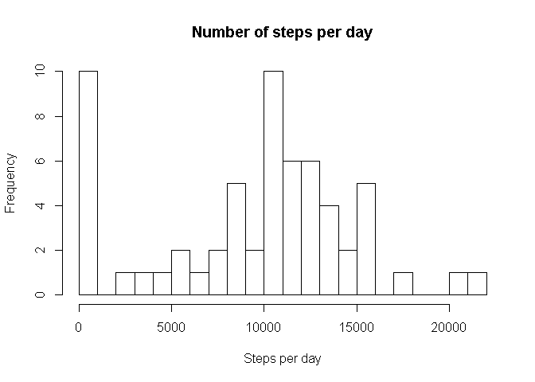
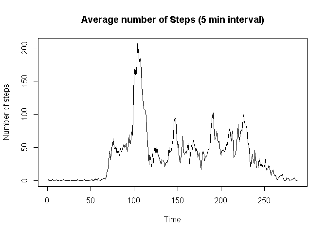
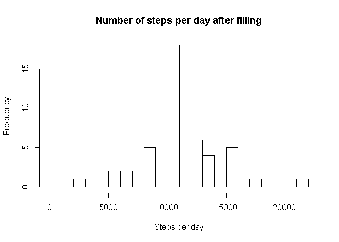
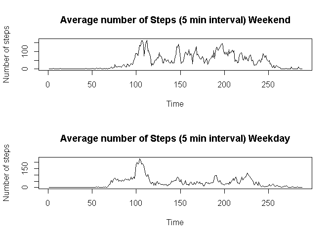

# Reproducible Research: Peer Assessment 1
## Loading and preprocessing the data
### Read input in given csv file, assumes in working directory

```r
data <- read.csv("activity.csv")
```

### Format the time

```r
data$final_date <- as.POSIXct(strptime(data$date, format="%Y-%m-%d"))
```

## What is mean total number of steps taken per day?
### Calculate the total number of steps taken per day

```r
steps_per_day <- tapply(data$steps, data$final_date, sum, na.rm = TRUE)
```

### Make histogram of steps taken each day

```r
hist(steps_per_day, xlab="Steps per day", main="Number of steps per day", breaks=20)
```

<!-- -->

### Mean of steps taken per day

```r
mean <- mean(steps_per_day)
mean
```

```
## [1] 9354.23
```

### Median of steps take per day

```r
median <- median(steps_per_day)
median
```

```
## [1] 10395
```

## What is the average daily activity pattern?

### Calculate the steps per interval

```r
steps_per_interval <- tapply(data$steps, data$interval, mean, na.rm=TRUE)
```

### Plot the 5-minute interval (x-axis) and the average number of steps taken, averaged across all days (y-axis)

```r
plot(steps_per_interval, type = "l", xlab="Time", ylab="Number of steps", main = "Average number of Steps (5 min interval)")
```

<!-- -->

### Find 5-minute interval that contains the maximum number of steps

```r
max_interval <- max(steps_per_interval)
max_interval_2 <- match(max_interval, steps_per_interval)
max_interval_name <- names(steps_per_interval)[max_interval_2]
max_interval_name
```

```
## [1] "835"
```

## Imputing missing values

### Calculate total number of missing values

```r
missing_values <- sum(is.na(data$steps))
missing_values
```

```
## [1] 2304
```

### Fill in the data

```r
filled_data <- data
```

### For each of the missing data, fill in using average of the corresponding 5-minutes interval for all days

```r
for (row_count in 1:nrow(filled_data)) 
{
  row = filled_data[row_count, ]
  if (is.na(row$steps)) 
  {
    filled_data[row_count, "steps"]=steps_per_interval[match(row$interval,names(steps_per_interval))]
  }
}
```

### Work with the new data

### Calculate the total number of steps taken per day for filled data

```r
steps_per_day_filled <- tapply(filled_data$steps, filled_data$final_date, sum)
```

### Make histogram of steps taken each day for filled data

```r
hist(steps_per_day_filled, xlab="Steps per day", main="Number of steps per day after filling", breaks=20)
```

<!-- -->

### Mean of steps taken per day for filled data

```r
mean_filled <- mean(steps_per_day_filled)
mean_filled
```

```
## [1] 10766.19
```

### Median of steps take per day for filled data

```r
median_filled <- median(steps_per_day_filled)
median_filled
```

```
## [1] 10766.19
```

### Yes, the mean and median differ from the first part of the assignment. The impact of inputting missing data is that the mean and median are now much closer.

## Are there differences in activity patterns between weekdays and weekends?

### Get the days

```r
all_days <- weekdays(filled_data$final_date)
```

### Assign date distiction

```r
weekends <- (all_days=="Saturday" | all_days=="Sunday")
all_days[weekends] <- "weekend"
all_days[!weekends] <- "weekday"
```

### Make into factor and add to data

```r
all_days <- as.factor(all_days)
filled_data$days <- all_days
```

### Break data by type of day

```r
filled_data_we <- subset(filled_data, days=="weekend")
filled_data_wd <- subset(filled_data, days=="weekday")
```

### Calculate the steps per interval per type of day

```r
steps_per_interval_we <- tapply(filled_data_we$steps, filled_data_we$interval, mean)
steps_per_interval_wd <- tapply(filled_data_wd$steps, filled_data_wd$interval, mean)
```

### Plot

```r
par(mfrow = c(2, 1))
plot(steps_per_interval_we, type = "l", xlab="Time", ylab="Number of steps", main = "Average number of Steps (5 min interval) Weekend")
plot(steps_per_interval_wd, type = "l", xlab="Time", ylab="Number of steps", main = "Average number of Steps (5 min interval) Weekday")
```

<!-- -->
